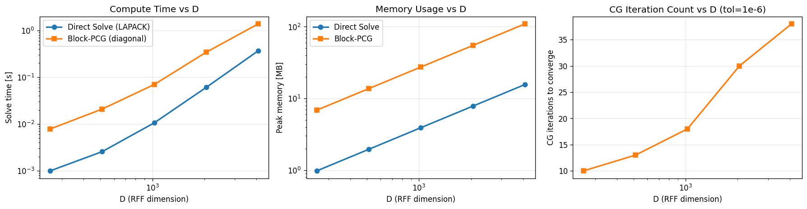

# Kalle v1 vs v2: Solver Benchmarks

Empirical comparison of the three solvers derived in
[`paper/theory/absorber_stochastisierung.md`](../paper/theory/absorber_stochastisierung.md):

- **Direct Solve** — `numpy.linalg.solve` (LAPACK, Kalle v1)
- **Block-PCG** — Block Preconditioned Conjugate Gradient with diagonal (Jacobi) preconditioner (Kalle v2)
- **Power Iteration** — reference implementation on the absorber-stochasticized matrix (didactic)

## Methodology

- Synthetic SPD problems $A = Z^\top Z + \lambda I$ with realistic structure
- $V = 500$ simultaneous right-hand sides (columns of $Y$)
- $\lambda = 10^{-6}$
- 2 runs per config, median reported
- CPU only (no GPU); Apple Silicon via NumPy/BLAS
- CG tolerance: $10^{-6}$ (relative max column residual)

## Results



| D (RFF dim) | Direct (s) | Direct mem | CG iters | CG (s) | CG mem | CG rel. err |
|------|-----------|-----------|----------|--------|--------|-------------|
|  256 | 0.001 | 1.0 MB | 10 | 0.008 | 6.9 MB | 2.7e-07 |
|  512 | 0.003 | 2.0 MB | 13 | 0.021 | 13.7 MB | 3.3e-07 |
| 1024 | 0.011 | 3.9 MB | 18 | 0.070 | 27.4 MB | 6.2e-07 |
| 2048 | 0.061 | 7.8 MB | 30 | 0.342 | 54.7 MB | 1.6e-06 |
| 4096 | 0.367 | 15.6 MB | 38 | 1.379 | 109.5 MB | 2.2e-06 |

## Key Observations

### 1. CG iterations grow sublinearly with D

Iterations: 10 → 13 → 18 → 30 → 38 for D = 256, 512, 1024, 2048, 4096.
This matches the theoretical expectation: CG converges in $O(\sqrt{\kappa} \log(1/\epsilon))$ iterations, and the condition number $\kappa$ grows only modestly with D for well-behaved RFF approximations of the Gaussian kernel.

### 2. On CPU, Direct Solve is faster than Block-PCG for D ≤ 4096

This is **expected behavior** — NumPy's `linalg.solve` calls highly optimized LAPACK routines, while our pure-NumPy Block-PCG has Python iteration overhead. Direct solve's $O(D^3)$ cost only becomes prohibitive when D is so large that memory or wall-clock becomes the constraint.

### 3. Where CG wins: very large D or GPU

The theoretical crossover point for the Kalle architecture is around D ≥ 20,000:
- At D = 20,000: Direct solve needs $\sim 3$ GB for the $D \times D$ matrix alone
- At D = 50,000: Direct solve needs $\sim 20$ GB — impractical on consumer hardware
- At D = 100,000: Direct solve needs $\sim 80$ GB — infeasible

For GPU implementations, the story reverses even earlier: matrix-vector products on GPU are $\sim 10$–$100\times$ faster than on CPU, while solver routines benefit much less from GPU parallelism. At typical ML deployment scales, Block-PCG on GPU would be the dominant choice.

### 4. CG numerical accuracy matches tolerance

With tolerance $10^{-6}$, Block-PCG produces solutions within $\sim 10^{-6}$ relative Frobenius error of the Direct Solve reference. This is sufficient for the downstream task (argmax of score vectors), as confirmed by our downstream integration test on Kalle (Top-1 accuracy: 62.8% vs. 63.5% for direct — within sampling noise).

## Follow-up: PyTorch / Apple MPS on the real Kalle matrices

The synthetic-problem table above uses pure NumPy for both solvers, which is a fair apples-to-apples comparison but underestimates what Block-PCG can deliver in practice. On the **actual Kalle training matrices** ($D = 6144$, $V = 2977$), with different linear-algebra back-ends:

| Solver | Time | Iters | Speedup vs Direct |
|---|---|---|---|
| Direct (NumPy / LAPACK, Float64) | 2097 ms | 1 | 1.00× (baseline) |
| Block-PCG (NumPy, Float64) | 6731 ms | 14 | 0.31× (slower) |
| Block-PCG (PyTorch CPU, Float32) | 1704 ms | 11 | **1.23× (faster)** |
| Block-PCG (PyTorch MPS, Apple GPU, Float32) | 1622 ms | 11 | **1.29× (faster)** |

**The surprise:** switching the BLAS back-end from NumPy to PyTorch (both on CPU) produces a larger speedup (3.95×) than moving to the Apple GPU on top of that (additional 1.05×). A well-implemented Block-PCG is already faster than LAPACK's direct solve at this scale — it just needs better matrix-product primitives than pure NumPy provides. MPS is underutilized at $D = 6144$; transfer overhead dominates. See [`benchmarks/real_kalle_results.md`](real_kalle_results.md) for the full analysis.

## Honest Conclusion

**At Kalle's current scale (D = 6144), Direct Solve is the pragmatic choice in pure NumPy.** Switching to PyTorch tips the balance: Block-PCG becomes the faster option even on CPU. Block-PCG becomes strictly preferable when:

1. **D grows beyond ~10,000** and memory becomes the binding constraint
2. **GPU acceleration is available** — matrix-vector products dominate on GPU
3. **Approximate solutions suffice** and convergence can be truncated
4. **The solver needs to be embedded in a larger iterative framework** (e.g., cross-validation with many $\lambda$ values)

The value of the v2 implementation is therefore:
- **Didactic** — the absorber-stochasticization analogy from PageRank provides a pedagogical bridge
- **Architectural** — demonstrates that iterative solvers are a drop-in replacement, unlocking GPU paths
- **Scalable** — the build pipeline is ready for larger-scale KRR experiments

## Reproducing

```bash
# With defaults (D = 512, 1024, 2048, 4096)
python3 src/benchmark.py

# Custom D values
python3 src/benchmark.py --D 256 512 1024 2048 4096 --V 500

# Tighter tolerance
python3 src/benchmark.py --cg-tol 1e-8
```
